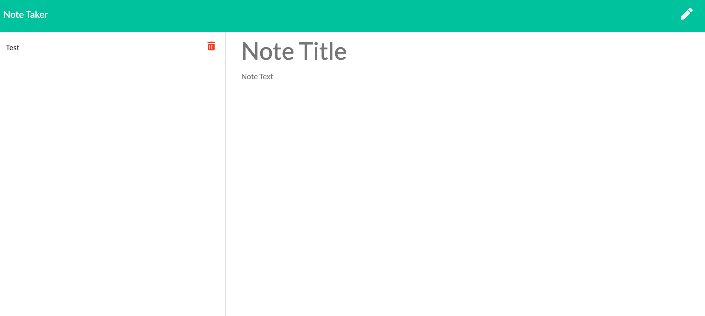

# gt-11-note-taker-final

## Description

This application uses express to create an online note taker that allows the user to create and delete their notes and have them saved into a database.

## Installation

Run "npm install" after cloning down the repository. Then, run node server.js in your terminal. Click on the link that shows up in your terminal or go to http://localhost:3000 in your browser.

## Usage

This application is designed for those looking for good, persistent notes.

## Contributing

This was a solo project completed for homework for the Georgia Tech Full-Stack Web Development Bootcamp. As always, the biggest shout-out to my classmates and TAs who are always ready to problem solve.

## License

MIT License

Copyright (c) [2020][maya stucky]

Permission is hereby granted, free of charge, to any person obtaining a copy of this software and associated documentation files (the "Software"), to deal in the Software without restriction, including without limitation the rights to use, copy, modify, merge, publish, distribute, sublicense, and/or sell copies of the Software, and to permit persons to whom the Software is furnished to do so, subject to the following conditions:

The above copyright notice and this permission notice shall be included in all copies or substantial portions of the Software.

THE SOFTWARE IS PROVIDED "AS IS", WITHOUT WARRANTY OF ANY KIND, EXPRESS OR IMPLIED, INCLUDING BUT NOT LIMITED TO THE WARRANTIES OF MERCHANTABILITY, FITNESS FOR A PARTICULAR PURPOSE AND NONINFRINGEMENT. IN NO EVENT SHALL THE AUTHORS OR COPYRIGHT HOLDERS BE LIABLE FOR ANY CLAIM, DAMAGES OR OTHER LIABILITY, WHETHER IN AN ACTION OF CONTRACT, TORT OR OTHERWISE, ARISING FROM, OUT OF OR IN CONNECTION WITH THE SOFTWARE OR THE USE OR OTHER DEALINGS IN THE SOFTWARE.

## URLs

[GitHub Repo](https://github.com/mayastucky/gt-11-note-taker-final)

[Heroku App](https://enigmatic-retreat-96846.herokuapp.com/)
